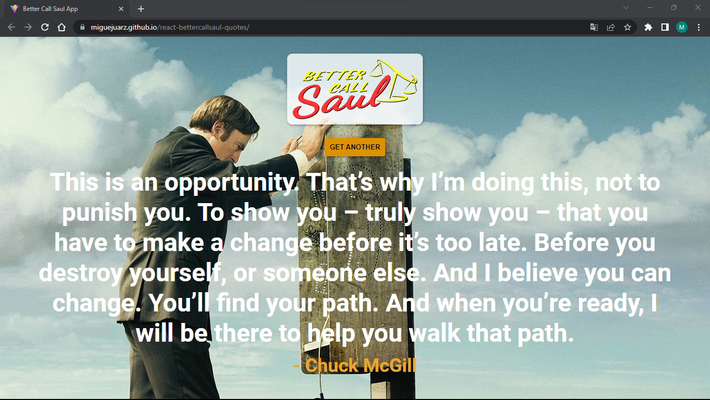
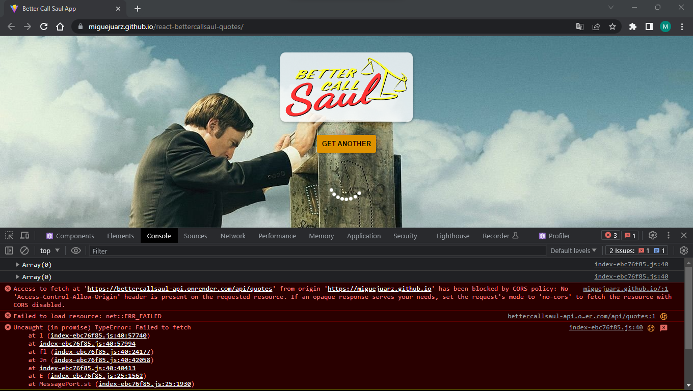

<h1>react-bettercallsaul-quotes</h1>

Esta es una aplicación creada en Reactjs donde se hace la peticion de las citas desde una API https://bettercallsaul-api.onrender.com/api, 
y que las muestre aleatoriamente

<h2>Capturas de pantalla</h2>

<h3>SI te sale este error</h3>

la que puedes hacer es descargar esta extension de chrome [![Allow CORS]](https://chrome.google.com/webstore/detail/allow-cors-access-control/lhobafahddgcelffkeicbaginigeejlf)
